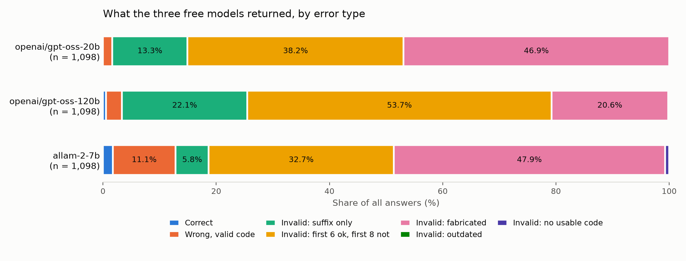

# Tariff Cost Benchmark

**In plain terms.** On the same 228 customs rulings, the two most accurate models tested, Claude Opus 5.5 and GPT-6 Sol, get the 8 digits that set the duty right only about half the time (53.5% and 49.1%) and cannot be told apart statistically. Their wrong answers are mostly real codes (59% for Opus 5.5, 69% for GPT-6 Sol), so a "does this code exist?" check catches only 31% to 41% of them; most of their invalid codes (68% and 65%) are suffix slips on a real 8-digit tariff line, which a tariff lookup could catch, although the first 8 digits are also right in only 43% and 33% of their invalid answers. About a third of their wrong answers change the duty rate (33% and 38%; median duty at stake $0 per $100,000), and on all 1,098 rulings the lean toward underpaying is detected in GPT-6 Sol (56.6%) but not in Claude Opus 5.5 (46.3%).

[](https://doi.org/10.5281/zenodo.23284516)

Interactive demo: https://claude.ai/artifact/F7JGzyoPMmeXtaNgDv4R3Z

**v1.2 (2026-10-11).** v1.1 plus: GPT-6 Sol extended from 200 to all 1,098 rulings, three Claude models added (Haiku 5.5, Sonnet 5.5, Opus 5.5), a provider replication of Kimi K3, DeepSeek V4.1 Flash and GLM 5.3 through OpenRouter, and, as post-hoc additions after the first push (see [PREREG_v1.2.md](PREREG_v1.2.md)), Nemotron 3 Ultra extended from 200 to all 1,098 rulings on the free route and a **same-sample restructure**: because all 11 models have now answered all 1,098 rulings, every model is graded on exactly the same rulings (Table 1: the same 228 rulings after every stated training cutoff; Table 2: the same 1,098 rulings, labelled as an upper bound). Each model's own post-cutoff results (228, 349, 538 or 1,098 rulings depending on the model) are in the appendix of [findings.md](findings.md). The v1.0 numbers for the three Groq models and the v1.1 numbers for the models other than Nemotron 3 Ultra and GPT-6 Sol are unchanged. Gemini 3.8 Flash is still in no table (2 of 200 responses). Pre-registrations: [PREREG_v1.1.md](PREREG_v1.1.md) and [PREREG_v1.2.md](PREREG_v1.2.md); deviations are listed in the [findings.md](findings.md) sections "Deviations from pre-registration".

**Headline:** Model choice matters most. On the same 228 rulings (dated July 1 to August 14, 2026, after every stated training cutoff), 8-digit accuracy, the level that sets the duty, runs from 0.0% (gpt-oss-20b) to 53.5% (Claude Opus 5.5). **Claude Opus 5.5 and GPT-6 Sol are tied; both get the 8-digit code right only about half the time.** Paired tests (exact McNemar at 8 digits, Holm-corrected over the 10 neighbouring pairs) find only two real gaps between neighbours in the ranking, DeepSeek V4.1 Flash to Nemotron 3 Ultra (adjusted p = 0.003) and Claude Haiku 5.5 to gpt-oss-120b (adjusted p < 0.0001); every other neighbouring pair is a tie, including Opus 5.5 against GPT-6 Sol (p = 0.20 before correction) and GPT-6 Sol against Sonnet 5.5 (p = 0.009 before correction, 0.073 after: borderline, not established). That gives four tiers: Opus 5.5 and GPT-6 Sol; Sonnet 5.5, Kimi K3 and DeepSeek V4.1 Flash; Nemotron 3 Ultra, GLM 5.3 and Haiku 5.5; and the three small models (under 4%). Opus 5.5 reasoning could not be disabled (about 297 reasoning tokens per answer). For Opus 5.5, GPT-6 Sol, Sonnet 5.5, Kimi K3, DeepSeek V4.1 Flash and Nemotron 3 Ultra most invalid codes are suffix slips on a real tariff line (53% to 69% of invalid answers on the 228); Claude Haiku 5.5 invents about as often as it slips and GLM 5.3 more often, and the three small models mostly invent codes. **The underpay lean is not a property of every model.** On all 1,098 rulings (Table 2, an upper bound) it is 46% to 67% of duty-changing errors and Gate B is met, also under a Holm correction, in 7 of 11 models (the three small models, GLM 5.3, Kimi K3, Haiku 5.5 and GPT-6 Sol) and not met in Claude Opus 5.5 (46.3%, n = 268), Sonnet 5.5, DeepSeek V4.1 Flash and Nemotron 3 Ultra. GPT-6 Sol, the second most accurate, shows the lean (56.6%, n = 256), so these tables do not support the idea that the lean fades as models improve. On the 228 the underpaid shares rest on 9 to 91 duty-changing errors and are descriptive only. All duty figures are MFN-only lower bounds.

### Table 1 (primary): all 11 models on the same 228 rulings

| Model | n | 8-digit accuracy (95% CI) | 10-digit accuracy (95% CI) | Invalid share | Format / invented, of invalid | Duty-changing errors (n) | Underpaid share (descriptive only) |
|---|---|---|---|---|---|---|---|
| claude-opus-5.5 ‡ | 228 | 53.5% (47.0% to 59.9%) | 32.9% (27.1% to 39.2%) | 27.6% | 68% / 32% | 51 | 45.1% |
| gpt-6-sol | 228 | 49.1% (42.7% to 55.6%) | 34.2% (28.4% to 40.6%) | 21.1% | 65% / 35% | 57 | 61.4% |
| claude-sonnet-5.5 ‡ | 228 | 40.4% (34.2% to 46.8%) | 25.4% (20.2% to 31.5%) | 39.0% | 53% / 47% | 49 | 57.1% |
| Kimi-K3 † | 228 | 39.0% (32.9% to 45.5%) | 25.0% (19.8% to 31.0%) | 25.0% | 68% / 32% | 74 | 58.1% |
| DeepSeek-V4.1-Flash † | 228 | 34.6% (28.8% to 41.0%) | 23.2% (18.2% to 29.1%) | 28.1% | 59% / 41% | 79 | 62.0% |
| nemotron-3-ultra-550b-a55b | 228 | 22.8% (17.8% to 28.7%) | 11.0% (7.5% to 15.7%) | 40.8% | 69% / 31% | 91 | 53.8% |
| GLM-5.3 † ‡ | 228 | 19.3% (14.7% to 24.9%) | 10.1% (6.8% to 14.7%) | 66.7% | 39% / 61% | 50 | 60.0% |
| claude-haiku-5.5 | 228 | 17.5% (13.2% to 23.0%) | 8.3% (5.4% to 12.6%) | 66.2% | 50% / 50% | 65 | 56.9% |
| gpt-oss-120b | 228 | 3.9% (2.1% to 7.3%) | 0.0% (0.0% to 1.7%) | 97.4% | 21% / 79% | 12 | 50.0% |
| allam-2-7b † | 228 | 1.8% (0.7% to 4.4%) | 0.4% (0.1% to 2.4%) | 87.3% | 9% / 91% | 27 | 81.5% |
| gpt-oss-20b | 228 | 0.0% (0.0% to 1.7%) | 0.0% (0.0% to 1.7%) | 98.7% | 12% / 88% | 9 | 55.6% |

**Table 1: the same 228 rulings for every model.** † no stated training cutoff: July-August is the best available window for these models, not a guarantee. ‡ reasoning could not be disabled: Opus 5.5 used about 297 reasoning tokens per answer, Sonnet 5.5 ran at minimal effort (reports no reasoning tokens but writes about 517 output tokens), and GLM 5.3 still emits reasoning tokens with thinking switched off (about 140 per answer on Baseten). With n = 228 the 95% intervals are about plus or minus 6 points. Duty-changing errors are wrong answers whose duty rate differs from the true code's; three models (gpt-oss-120b, allam-2-7b, gpt-oss-20b) have fewer than 30 of them here, which is why Gate B is run on the 1,098 set below and the 228 underpaid shares are descriptive only. Paired-test details and the all-pairs check are in [findings.md](findings.md) and `review/same_sample.md`.



(The same figure on all 1,098 rulings, an upper bound, is `figures/error_breakdown_all.png`.)

### Table 2 (upper bound): all 11 models on the same 1,098 rulings

| Model | n | 8-digit accuracy (95% CI) | 10-digit accuracy (95% CI) | Invalid share | Format / invented, of invalid | Duty-changing errors (n) | Underpaid share | Gate B |
|---|---|---|---|---|---|---|---|---|
| claude-opus-5.5 ‡ | 1,098 | 55.4% (52.4% to 58.3%) | 35.3% (32.6% to 38.2%) | 27.8% | 75% / 25% | 268 | 46.3% | not met |
| gpt-6-sol | 1,098 | 54.4% (51.4% to 57.3%) | 37.5% (34.7% to 40.4%) | 22.6% | 70% / 30% | 256 | 56.6% | met |
| claude-sonnet-5.5 ‡ | 1,098 | 44.9% (42.0% to 47.9%) | 25.2% (22.7% to 27.9%) | 39.9% | 62% / 38% | 264 | 53.8% | not met |
| Kimi-K3 † | 1,098 | 43.4% (40.5% to 46.4%) | 28.4% (25.8% to 31.2%) | 25.3% | 68% / 32% | 311 | 59.2% | met |
| DeepSeek-V4.1-Flash † | 1,098 | 39.3% (36.4% to 42.2%) | 25.0% (22.6% to 27.7%) | 32.2% | 58% / 42% | 324 | 54.0% | not met |
| nemotron-3-ultra-550b-a55b | 1,098 | 30.0% (27.3% to 32.7%) | 14.2% (12.3% to 16.4%) | 41.8% | 74% / 26% | 384 | 49.0% | not met |
| GLM-5.3 † ‡ | 1,098 | 25.1% (22.7% to 27.8%) | 12.4% (10.6% to 14.5%) | 67.6% | 42% / 58% | 212 | 55.7% | met |
| claude-haiku-5.5 | 1,098 | 18.1% (16.0% to 20.5%) | 7.9% (6.5% to 9.7%) | 63.7% | 49% / 51% | 281 | 53.0% | met |
| gpt-oss-120b | 1,098 | 5.6% (4.3% to 7.1%) | 0.5% (0.3% to 1.2%) | 96.6% | 23% / 77% | 49 | 65.3% | met |
| allam-2-7b † | 1,098 | 2.4% (1.6% to 3.4%) | 1.7% (1.1% to 2.7%) | 87.2% | 8% / 92% | 116 | 65.5% | met |
| gpt-oss-20b | 1,098 | 0.3% (0.1% to 0.8%) | 0.0% (0.0% to 0.3%) | 98.4% | 14% / 86% | 46 | 67.4% | met |

**Table 2: the same 1,098 rulings for every model (upper bound: includes rulings that may be in training data).** Gate B is the pre-registered rule (permutation p < 0.05 against Baseline 2 with at least 30 duty-changing errors); the verdicts are the same under a Holm correction across the 11 models and without the 40 rulings whose description is not a product description. Gate B on the 228 is not run because several models have fewer than 30 duty-changing errors there.

**Provider replication (Kimi K3, DeepSeek V4.1 Flash, GLM 5.3 rerun on OpenRouter with Baseten excluded, same prompt and temperature 0):** Kimi K3 and DeepSeek V4.1 Flash replicate: 8-digit accuracy moves by -1.3 and -0.6 points and the identical code comes back for 85% and 81% of the 1,098 rulings. GLM 5.3 accuracy matches (-2.5 points) but its answers do not (23% identical codes), and its reasoning setting also changed (thinking disabled on Baseten, low effort on OpenRouter), so the gap is not only the provider. OpenRouter spread each model over 18 to 31 providers. The primary results stay the v1.1 Baseten runs.

**A validity check detects most errors for the small models, not for most of the others.** On the 1,098 set, flagging any code that does not exist catches 98.4%, 97.2% and 88.7% of wrong answers for gpt-oss-20b, gpt-oss-120b and allam-2-7b, 34% to 48% for Kimi K3, GPT-6 Sol, Claude Opus 5.5, DeepSeek V4.1 Flash and Nemotron 3 Ultra, and 52% to 77% for Claude Sonnet 5.5, Claude Haiku 5.5 and GLM 5.3, because their wrong answers are mostly valid codes. On the 228 it catches 31.3% (GPT-6 Sol) and 41.2% (Opus 5.5). Asking a v1.0 model to retry after "that code does not exist" turned 1.5% to 7.2% of its invalid answers into valid codes and none into the correct code; the retry test was not repeated for the other models.

**Direction of errors (Table 2, upper bound):** among duty-changing errors, 65% to 67% underpaid for the three small models and 46% to 59% for the other eight (n = 46 to 384 per model). Gate B is met in 7 of 11 models, also under Holm, and not met in Claude Opus 5.5 (46.3%, n = 268), Sonnet 5.5 (53.8%, p = 0.074), DeepSeek V4.1 Flash (54.0%) and Nemotron 3 Ultra (49.0%). The 95% intervals exclude 50% only for the three small models, Kimi K3 and GPT-6 Sol (50.5% to 62.6%); for Opus 5.5, Sonnet 5.5, DeepSeek V4.1 Flash, Nemotron 3 Ultra, GLM 5.3 (met, 48.9% to 62.2%) and Haiku 5.5 (met, 47.2% to 58.8%) they include it, so passing the baseline test does not mean a large lean. On the 228 the shares are 45.1% (Opus 5.5, n = 51), 61.4% (GPT-6 Sol, n = 57) and 53.8% to 62.0% for Nemotron, Kimi K3, DeepSeek V4.1 Flash and GLM 5.3, descriptive only. Only a minority of wrong answers can be compared on duty (it needs a rate for both codes), so this describes that set, not all errors. The median duty at stake is $0 per $100,000 for the strongest models; MFN-only lower bounds.

**Is the gap before and after a cutoff contamination or harder later rulings?** Splitting all 1,098 rulings at April 20, 2026 (`review/time_drift.md`, no new calls), GPT-6 Sol falls from 58.9% to 49.6% at 8 digits (-9.3 points, p = 0.002). The Baseten runs of DeepSeek, GLM and Kimi fall by 7.7, 7.7 and 9.7 points (p = 0.009, 0.003, 0.001). Nemotron 3 Ultra falls 5.9 points across the same date (32.9% to 27.0%, p = 0.033). gpt-oss-120b, whose cutoff is 2024, does not fall (5.9% to 5.2%, p = 0.62) and gpt-oss-20b is at 0.0% and 0.6%. By the rule set before this test, the lack of a drop in the 2024-cutoff models would make contamination the more likely reading of the Sol gap, and the † models' all-1,098 numbers would be called likely inflated; but that control is weak (the two gpt-oss models sit near zero, and the test had only 5% to 10% power to detect a drop of Sol's relative size, 16%), and Claude Sonnet 5.5, whose cutoff is June 30, also drops across April 20 (48.4% to 41.3%, p = 0.018). The data do not separate the two explanations; the † numbers stay upper bounds. The memorisation probe (v1.1) is uninformative for DeepSeek and GLM, which refused 96 and 95 of 100 probes, and was not repeated in v1.2.

Sonnet 5.5, Opus 5.5 and GLM 5.3 on OpenRouter cannot be run with reasoning off (the API rejects it), so they ran at minimal or low reasoning effort; Opus 5.5's result is not a no-reasoning result like the others. GPT-6 Sol and Claude Haiku 5.5, Sonnet 5.5 and Opus 5.5 are the closed models in these tables (paid routes through OpenRouter; this round cost $21.36 in total); every other model was run free, including the Nemotron 3 Ultra extension ($0). Gemini is not in any table (Gemini 3.8 Flash has 2 of 200 responses). No other closed model was tested, and each of these is one model, not a stand-in for other GPT or Claude models or for Gemini. Limits: the models answer from the description alone, with no retrieval or tariff lookup, and the top tiers (Claude Fable 5.1 and OpenAI's tier above GPT-6 Sol) were not tested. Description quality: 40 of the 1,098 rulings (3.6%) have a cleaned description that is not a product description; the tables include them, and the sensitivity run without them changes no Gate B verdict on the 1,098 set (see [findings.md](findings.md) and `review/description_quality.md`).

This is a finding about the models listed above at their lowest accepted reasoning level, not a claim that the task is inherently hard. Prior work reports 10-digit scores of about 12.5% to 40% under different conditions (ATLAS: a different benchmark, models and prompting); the models here score 0.0% to 34.2% at 10 digits on the same 228 rulings (0.0% to 0.4% for the small ones). All findings survived a hostile re-audit: Round 2 for v1.0, [review/v1_1_attack.md](review/v1_1_attack.md) for v1.1 and [review/v1_2_attack.md](review/v1_2_attack.md) for v1.2, which also list what the results cannot support. See [findings.md](findings.md) for the full results, method, and limitations, and [DECISIONS.md](DECISIONS.md) for the audit trail. All calls are in `data/exports/api_calls.csv`.

**Question:** When AI models classify imported goods for US customs, how often are they
wrong, how much duty is at stake per error, and do their errors lean toward underpaying
(the legally dangerous direction)?

- **Ground truth:** US Customs and Border Protection (CBP) binding classification rulings
  from the CROSS database (rulings.cbp.gov), NY collection.
- **Duty data:** the official Harmonized Tariff Schedule from USITC (hts.usitc.gov), the
  release in force on each ruling's date, with MFN rates re-read from each release's
  archived PDF (0 of 4,060 code-date pairs had a rate different from the current schedule).
- **What's new vs. prior work** (ATLAS arXiv 2509.18400, Tarifflo arXiv 2412.14179, UNB
  arXiv 2606.16987, all accuracy-only): this project measures the *duty cost* of
  classification errors, tests for *direction bias* (under- vs over-paying), and guards
  against training-data contamination by restricting to rulings dated after each model's
  training cutoff.

Author: Aya Emssaad (GitHub: fennaya)

## Status

See [STATUS.md](STATUS.md) for current phase, gate results, and what runs next.
See [DECISIONS.md](DECISIONS.md) for the log of judgment calls made along the way.
See [BLOCKERS.md](BLOCKERS.md) for anything parked pending money, credentials, or a
human decision.

## Reproduce

The commands use the Windows layout. On Mac or Linux, replace `.venv/Scripts/python` with `.venv/bin/python`. Nothing else changes. `scripts/run_gemini_daily.bat` is Windows only. On Mac or Linux, schedule the same Python command with cron instead.

```bash
uv venv --python 3.12.14 .venv
uv pip install --python .venv requests pandas scipy matplotlib

.venv/Scripts/python scripts/fetch_rulings.py        # Phase 1: CBP CROSS rulings (resumable)
.venv/Scripts/python scripts/fetch_hts.py             # Phase 3: USITC HTS revisions (resumable)
.venv/Scripts/python scripts/clean_descriptions.py    # Phase 2: leak-safe descriptions (Gate 2)
.venv/Scripts/python scripts/build_usable_set.py      # Phase 1: single-product/single-code filter (Gate 1b)
.venv/Scripts/python scripts/parse_duty_rates.py       # Phase 3: duty rate resolution (Gate 3)
.venv/Scripts/python scripts/build_exclusions_table.py

# Requires a free-tier LLM key (GROQ_API_KEY checked first) in the environment:
.venv/Scripts/python scripts/select_models.py          # Phase 0: pin exact model IDs
.venv/Scripts/python scripts/run_llm_classification.py --n 50   # Phase 4: pilot
.venv/Scripts/python scripts/run_llm_classification.py          # Phase 5: full run
.venv/Scripts/python analysis.py                        # Phase 6
.venv/Scripts/python scripts/build_demo_data.py
.venv/Scripts/python scripts/translate_sample.py         # Phase 7 prep (stops for human review)

# Round 2 (hostile audit of both headlines):
.venv/Scripts/python scripts/audit_accuracy.py          # Gate A: is the low accuracy a bug?
.venv/Scripts/python scripts/build_stripping_audit.py   # input generated; judgments are by hand
.venv/Scripts/python scripts/audit_direction.py         # Gate B: does underpay bias beat chance?
.venv/Scripts/python scripts/build_translation_html.py  # review/translation_review.html (mark by hand)
.venv/Scripts/python scripts/run_llm_translations.py --lang fr --model <model_id>   # Phase 7, once marked
.venv/Scripts/python scripts/run_llm_translations.py --lang ar --model <model_id>
.venv/Scripts/python scripts/analyze_language.py        # paired language comparison

# Round 3 (invalid-code breakdown, guardrail, chart):
.venv/Scripts/python scripts/fetch_older_hts.py         # archived HTS releases 2022-2026 as PDFs, parsed (slow: ~90 PDFs)
.venv/Scripts/python scripts/analyze_invalid_codes.py   # breakdown, outdated check, dollar figure
.venv/Scripts/python scripts/run_guardrail_followup.py --model <model_id>   # needs a Groq key; one run per model
.venv/Scripts/python scripts/analyze_guardrail.py
.venv/Scripts/python scripts/make_error_breakdown_chart.py   # figures/error_breakdown.png
.venv/Scripts/python scripts/check_revision_impact.py
.venv/Scripts/python scripts/parse_release_rates.py     # MFN rates per 2026 release from the PDFs
.venv/Scripts/python scripts/check_rate_impact.py       # ruling-date vs current rates, dollar figures re-run
.venv/Scripts/python scripts/analyze_validity_check.py  # what a validity check flags
.venv/Scripts/python scripts/analyze_underpay_summary.py  # underpay n, Wilson CI, baseline p

# v1.1 (stronger models; keys in .env: BASETEN_API_KEY, OPENROUTER_API_KEY; models and settings in config.json):
.venv/Scripts/python scripts/build_probe_ids.py          # Check A sample (seed 20261007)
.venv/Scripts/python scripts/run_new_models.py --model <model_id> --n 50     # pilot; then without --n for the full run
.venv/Scripts/python scripts/run_new_models.py --model <model_id> --probe    # Check A, ruling number only
.venv/Scripts/python scripts/verify_parser.py             # new parser vs every cached v1.0 answer
.venv/Scripts/python scripts/analyze_format_vs_invention.py
.venv/Scripts/python scripts/analyze_v1_1.py              # review/v1_1_results.md, biggest_misses.md
.venv/Scripts/python scripts/export_api_calls.py          # data/exports/api_calls.csv
```

All raw data is cached under `data/raw/` (CBP rulings, HTS revisions) and `llm_logs/`
(model responses). Every script is resumable and re-downloads nothing already cached.
All numbers in `findings.md` are produced by these scripts run against that cached data
and nothing is hand-typed. See [STATUS.md](STATUS.md) for what's actually been run so far.

## What is tracked, and rebuilding the raw data

Everything needed to reproduce every number in `findings.md` is in git:
`data/raw/rulings/` and `data/raw/search_pages/` (the CBP rulings as fetched, 18 MB),
`data/processed/` (cleaned descriptions, usable set, duty rates), `data/compact/hts_revisions/`
(the HTS code and rate tables, trimmed and gzipped, 9 MB), `data/compact/hts_older/` and
`data/compact/hts_rates/` (HTS codes and MFN rates parsed from the archived release PDFs),
`llm_logs/`, `llm_probes/` and `llm_followups/` (every model response), `data/exports/` (one row per model call), `run_logs/` (console logs of the
runs), `review/translation_review_marked.csv`, and all scripts. Run `analysis.py` and the
`scripts/audit_*.py` / `analyze_language.py` scripts above directly on a fresh clone.

Not tracked: `data/raw/hts_revisions/` (255 MB of raw USITC dumps) and
`data/raw/hts_older_pdf/` (the archived HTS release PDFs, 1.7 GB), plus the local-only Gemini
files until v1.1. Note: the 21 files in `data/raw/hts_revisions/` are all copies of the current schedule, because USITC's JSON export ignores the release parameter. Archived releases exist only as PDFs, which `scripts/fetch_older_hts.py` fetches and parses. The scripts layer each ruling-date release's PDF rates onto the JSON. See the Limitations in findings.md. To
rebuild the untracked files from scratch, from a fresh clone:

```bash
uv venv --python 3.12.14 .venv
uv pip install --python .venv requests pandas scipy matplotlib pymupdf
.venv/Scripts/python scripts/fetch_hts.py              # re-downloads the 21 USITC revisions
.venv/Scripts/python scripts/build_compact_hts.py      # optional: regenerates data/compact/
```

To rebuild everything upstream of that too (CBP rulings, cleaning, usable set, duty rates),
run the Phase 1-3 commands in the Reproduce section in order. All fetch scripts are
resumable and hit only the public CBP/USITC APIs, no key needed. Scripts use the raw HTS
files when present and the compact copy otherwise.

## History

Earlier rounds, kept for reference. The v1.0 numbers below are unchanged in v1.1 and v1.2.

**Key numbers (v1.0, unchanged in v1.1 and v1.2):**
- **5.6% / 2.4% / 0.3%** is the 8-digit (duty-bearing) accuracy for gpt-oss-120b / allam-2-7b / gpt-oss-20b on 1,098 post-training-cutoff CBP rulings.
- **0.5% / 1.7% / 0.0%** is the 10-digit accuracy for the same models.

## Data license

CBP ruling text and the USITC Harmonized Tariff Schedule data used in this project are
**works of the United States Government and not subject to copyright** (17 U.S.C. § 105:
"Copyright protection under this title is not available for any work of the United
States Government"; https://www.law.cornell.edu/uscode/text/17/105). CBP's own site
states this explicitly for its content: "information on the U.S. Customs and Border
Protection website is in the public domain and may be reproduced, published or
otherwise used without the permission of the CBP" (https://www.cbp.gov/site-policy-notices/copyright-notice).
This project's own code is MIT licensed; its analysis and findings are CC BY 4.0. See
`CITATION.cff`.

## Cite this work

Emssaad, A. Tariff Cost Benchmark: Duty-at-Stake and Direction Bias in LLM Customs Classification. Zenodo. https://doi.org/10.5281/zenodo.23197896
